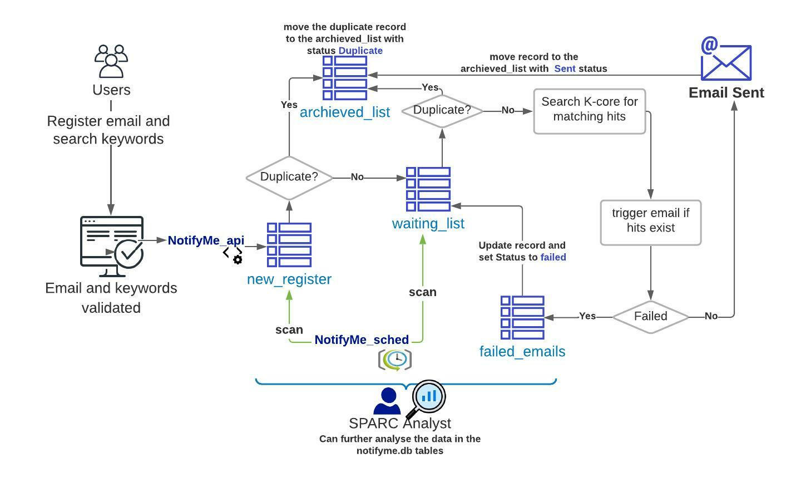

# NotifyMe
### An email notification functionality

## Main Purpose

The main purpose of this functionality is to notify users whenever a new dataset is published against their search terms if nothing is available at the moment.

However, users can still use the same function, to receive an summary table including basic information and links to all datasets currently matching their keywords.

Additionally, as requests are saved in a database, this information can be further access and analysed to get insights for further content improvement.

## How to run

1. First, update the [properties.ini](./properties.ini) with the required information like sending email password and the scicrunch api-key

2. Run [notifyme_api.py](./notifyme_api.py), in order fetch the user email and search keywords.
 
 an example call:  http://localhost:5432/aqua/notifyme?email="<email>"&keywords="<keywords>"

3. In order to schedule the keywords search and sending emails, you need to run [notifyme_sched.py](./notifyme_sched.py)

   The current setting is scheduling emails to be sent daily at 2 am

4. The request are saved in a SQLite database. the description of the database tables is available in [NotifyMe_Database.pdf](./NotifyMe_Database.pdf)
 
5. A sample analytics visualization can run through [NotifyMe_analytics_visual.ipynb](https://nbviewer.jupyter.org/github/lrasmy/aqua/blob/main/NotifyMe/NotifyMe_analytics_visual.ipynb)
 

## How it works

   
    
  </img>

## Required Packages
- configparser
- flask_restplus
- numpy
- pandas
- schedule
- smtplib
- sqlite3

and plotly express for visualization examples
