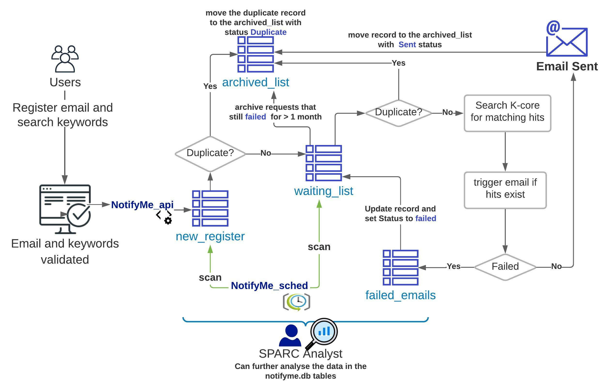

# NotifyMe
### An email notification functionality

## Main Purpose

The NotifyMe option is to send emails that summarize search results against exact keywords. NotifyMe sends the email just once at least one exact hitting match exists. Therefore, NotifyMe can be used for:

     1.	Notify users when a dataset gets published against keywords that don’t retrieve any results yet.
     2.	Emailing the current search results in a tabular format, which can be found helpful for users.

Additionally, NotifyMe stores all requests in an SQLite database, which can be further analyzed by the SPARC team to understand the search pattern and get more insights on the demand. For example, the SPARC team can find out the most common keywords searched with no existing matches and decide on actions to fulfill such needs. 

## How it works

 We can summarize NotifyMe actions as follow:
 
       1.	Add email requests with keywords 
 
       2.	Scan for existing search hits and send email
 
       3.	Moving pending requests to a waiting list, that’s scanned daily
 
       4.	Moving fulfilled requests to an archived list
 
       5.	Any failed requests (that already have matching hits) will remain in the waiting list for one month,
          during which NotifyMe will try to send the email on daily basis. Afterward, if the email still failing,
          it will move to the archived list with a final failed status for efficiency.
 

   
    
  </img>

## How to run

1. First, update the [properties.ini](./properties.ini) with the required information like sending email password and the scicrunch api-key

2. Run [notifyme_api.py](./notifyme_api.py), in order fetch the user email and search keywords.
 
 an example call:  http://localhost:5432/aqua/notifyme?email="<email>"&keywords="<keywords>"

3. In order to schedule the keywords search and sending emails, you need to run [notifyme_sched.py](./notifyme_sched.py)

   The current setting is scheduling emails to be sent daily at 2 am

4. The request are saved in a SQLite database. the description of the database tables is available in [NotifyMe_Database.pdf](./NotifyMe_Database.pdf)
 
5. A sample analytics visualization can run through [NotifyMe_analytics_visual.ipynb](https://nbviewer.jupyter.org/github/lrasmy/aqua/blob/main/NotifyMe/NotifyMe_analytics_visual.ipynb)
 

## Required Packages
- configparser
- flask_restplus
- numpy
- pandas
- schedule
- smtplib
- sqlite3

and plotly express for visualization examples
